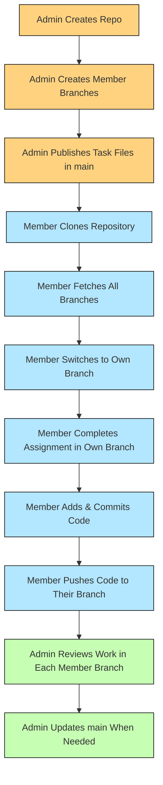

# AU-IGNITE
Team project repository for developing, tracking, and maintaining all code and documentation.


## 📌 Quick Overview

- The **admin publishes tasks** (markdown files) in the `main` branch.
- Each member completes the task **in their personal branch only**.
- ❗ **No member is allowed to merge anything into main.**
- ❗ **Do not edit or push to another member’s branch.**

## 📄 Task Files (Naming Rules)

Tasks appear in main as Markdown files:
task1.md
task2.md
task3.md


The admin will announce which task to complete (e.g., *“Complete task2.md”*).

If starter code is required, it will be provided inside or alongside the task file.

---

## 📁 Repository Structure (Example)
main/ → Admin only (tasks like task1.md, task2.md)
└── task1.md
└── task2.md

piyush-suthar/ → Member branch
nishant-kumawat/
Pratik/
hema-negi/
Faijan/


Every member has **one dedicated branch**.  
Branches must remain separate — **no cross-branch modifications**.

---

## 🔐 Branch Rules & Permissions

### **Main Branch (`main`)**
- Admin-only access
- Members **must NOT**:
  - push changes  
  - edit files  
  - merge anything into main  

### **Member Branches (Example: `shubham`)**
- Work ONLY in your branch
- Push ONLY to your branch
- Don’t touch other members’ branches
- Don’t merge branches or create PRs
- Don’t create new branches without admin approval

> ⚠ Even if GitHub doesn't restrict it technically, these rules MUST be followed.  
> The admin will revert incorrect commits.

---


## 🚀 How to Submit Your Assignment
## 🔀 Git Branch Workflow Diagram


### 1️⃣ Clone the repository
```bash
git clone <repo-url>
cd <repo-folder>

